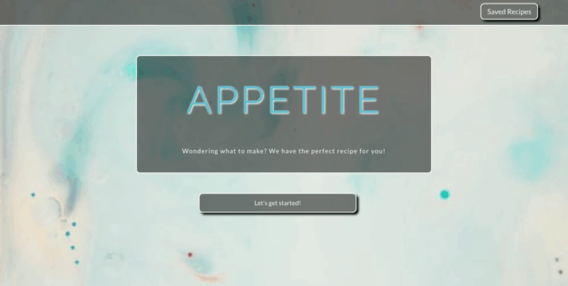
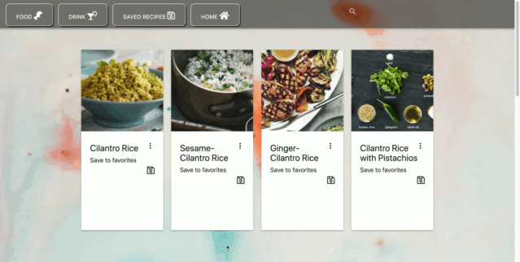

# APPetite-Project

This application is designed to prompt a user to input food or drink ingredients and to supply recipes that include those ingredients.

## Motivation
Have you ever opened up your fridge only to realize that you don't know what to make with what's in there? Or have you been at the grocery store and seen a fantastic sale on pork, only to realize you don't know any pork dishes? This app can help. All you need to do is list out ingredients that you have on hand, and it will return results that use those ingredients.

## Interface
After a user completes the initial search, they can choose to search for drinks that utilize those ingredients, or just browse through the recipes on the page and click on any that look promising. This click will bring up a list of ingredients and a link to the recipe will open in a new tab.

Assuming that the user finds a suitable recipe, they can save it by simply pressing the 'save' icon. This icon then changes into a heart, visually signaling that it has been added to the user's saved recipes. The recipe can then be viewed in the 'saved recipes' tab.

## Technologies
This site was written using:
* Foundation
* Materialize
* Javascript
* JQuery

## APIs 
We used the [Edamam](https://developer.edamam.com/) and [TheCocktailDB](https://www.thecocktaildb.com/api.php) APIs in our app. In addition, our card animation was achieved by using the [Animate on Scroll](https://michalsnik.github.io/aos/) library.

## Contributors
* Avery Stahl
* Clarisse Moraes
* Craig Gant

## Credits
In setting up this project, we closely followed the guidelines provided by the [UCF Coding Bootcamp](https://github.com/UCF-Coding-Boot-Camp/UCF-ORL-FSF-FT-11-2019-U-C).

Our background image was found on [unsplash.com](https://unsplash.com/).